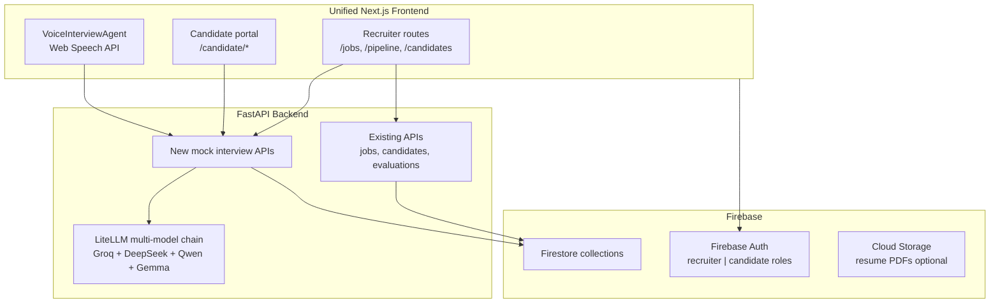
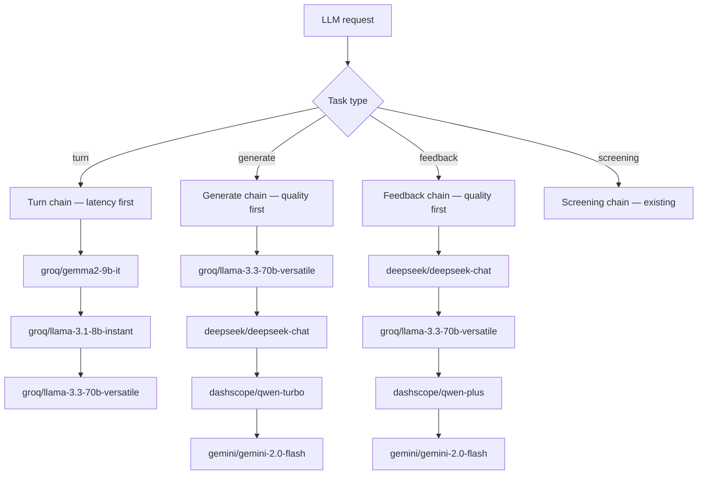
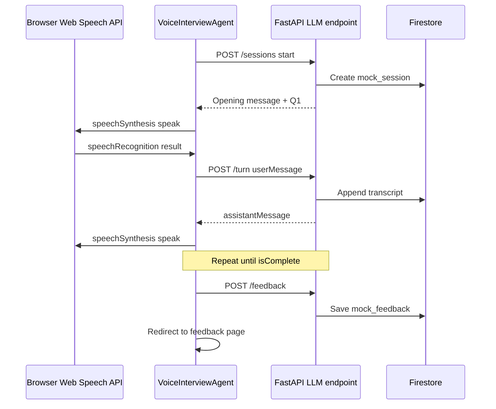

# Intelligent Mock Interview Platform — Integration Plan

## Current State

| App | Stack | Role |
|-----|-------|------|
| [`frontend/`](frontend/) + [`backend/`](backend/) | Next.js 16 + FastAPI + **Supabase** | Recruiter screening pipeline (resume eval, ranking, emails, Jitsi scheduling) |
| [`ai_mock_interviews-main/`](ai_mock_interviews-main/) | Next.js 15 + **Firebase** + **Vapi** + Gemini | Candidate mock interviews (voice, questions, feedback) |

Your backend already supports Groq via LiteLLM fallback in [`backend/app/core/llm.py`](backend/app/core/llm.py). The mock interview project’s valuable pieces to port: question generation, transcript-based feedback (Zod schema in [`ai_mock_interviews-main/constants/index.ts`](ai_mock_interviews-main/constants/index.ts)), and the interview UI flow — **not** Vapi itself.

---

## Target Architecture



**Key decisions (based on your answers):**
- Keep **FastAPI** for Python ML/data work (pandas, scipy, pdfplumber, scoring engine) — do not rewrite screening logic in Next.js server actions.
- **Single unified frontend** in [`frontend/`](frontend/) with route groups for recruiter vs candidate.
- **Multi-model LLM via LiteLLM** — Groq free tier hosts open models (Llama 3.3, Gemma 2); add DeepSeek and Qwen via their free API tiers; keep Gemini as final fallback. See [Multi-Model LLM Strategy](#multi-model-llm-strategy) below.
- **Embeddings stay on Gemini** (`gemini-embedding-001`) for screening semantic match — Groq/DeepSeek/Qwen do not offer a comparable free embedding API.
- **Vapi replacement:** browser **Web Speech API** (STT + TTS) orchestrated by FastAPI conversation endpoints.

---

## Multi-Model LLM Strategy

Yes — DeepSeek, Qwen, and Gemma are all sufficient for mock interviews (question generation, conversational turns, structured feedback). The existing [`backend/app/core/llm.py`](backend/app/core/llm.py) already uses LiteLLM with a fallback chain; we extend it with **task-specific chains** rather than a single provider.

### Why multiple models?

| Task | Priority | Best fit |
|------|----------|----------|
| **Interview turns** (voice, real-time) | Speed + natural dialogue | Groq Gemma 2 9B, Groq Llama 3.1 8B (fastest LPU inference) |
| **Question generation** (JSON array) | Quality + structured output | Groq Llama 3.3 70B → DeepSeek Chat → Qwen Turbo |
| **Feedback evaluation** (JSON scores) | Quality + consistency | DeepSeek Chat → Groq Llama 3.3 70B → Qwen Plus → Gemini |
| **Resume screening** (existing) | Quality + JSON | Gemini Flash → Groq Llama 3.3 70B (unchanged) |

### Recommended model chain (all free-tier APIs)



### Provider details

| Model | LiteLLM ID | Provider | Free tier | Best for |
|-------|-----------|----------|-----------|----------|
| **Llama 3.3 70B** | `groq/llama-3.3-70b-versatile` | Groq | Yes (rate-limited) | General quality, JSON generation |
| **Gemma 2 9B** | `groq/gemma2-9b-it` | Groq | Yes | Fast interview turns, short responses |
| **Llama 3.1 8B** | `groq/llama-3.1-8b-instant` | Groq | Yes | Ultra-fast fallback for voice turns |
| **DeepSeek Chat** | `deepseek/deepseek-chat` | DeepSeek API | Free credits on signup | Strong reasoning, feedback eval |
| **Qwen Turbo/Plus** | `dashscope/qwen-turbo` / `dashscope/qwen-plus` | Alibaba DashScope | Free tier available | Structured JSON, multilingual |
| **Gemini Flash** | `gemini/gemini-2.0-flash` | Google AI | Free tier | Final fallback for all tasks |

All accessed through the **existing LiteLLM** layer — no new SDKs needed beyond API keys.

### Implementation in `llm.py`

Refactor [`backend/app/core/llm.py`](backend/app/core/llm.py):

```python
# Task-specific chains — tried in order until one succeeds
MOCK_TURN_CHAIN = [
    "groq/gemma2-9b-it",           # Gemma — fast, good dialogue
    "groq/llama-3.1-8b-instant",
    "groq/llama-3.3-70b-versatile",
]
MOCK_GENERATE_CHAIN = [
    "groq/llama-3.3-70b-versatile",
    "deepseek/deepseek-chat",        # DeepSeek — strong open model
    "dashscope/qwen-turbo",          # Qwen — good structured output
    "gemini/gemini-2.0-flash",
]
MOCK_FEEDBACK_CHAIN = [
    "deepseek/deepseek-chat",
    "groq/llama-3.3-70b-versatile",
    "dashscope/qwen-plus",
    "gemini/gemini-2.0-flash",
]

async def llm_completion(prompt, system_prompt="", json_mode=False, task="screening"): ...
async def llm_json_completion(prompt, system_prompt="", task="screening"): ...
```

Mock interview service calls:
- `llm_json_completion(..., task="generate")` for questions
- `llm_completion(..., task="turn")` for live interview dialogue
- `llm_json_completion(..., task="feedback")` for evaluation scores

Chains overridable via env: `MOCK_TURN_MODELS`, `MOCK_GENERATE_MODELS`, `MOCK_FEEDBACK_MODELS` (comma-separated LiteLLM model IDs).

### What we are NOT adding (unless you ask later)

- **Self-hosted Ollama/vLLM** — requires GPU; out of scope for free cloud deployment on Render.
- **OpenRouter as primary** — optional future aggregator; direct provider APIs are simpler and free enough.
- **Replacing Gemini embeddings** — no free DeepSeek/Qwen/Gemma embedding API matches quality today.

---

## Phase 1 — Firebase Foundation (Replace Supabase)

### 1.1 Firebase project setup
- Initialize Firebase project via MCP or console: Firestore, Auth (email/password), optional Cloud Storage.
- Add service account credentials to [`backend/app/config.py`](backend/app/config.py): `FIREBASE_PROJECT_ID`, `FIREBASE_CREDENTIALS_JSON`.
- Add web SDK config to [`frontend/.env.local`](frontend/.env.local).

### 1.2 Firestore schema (maps from existing PostgreSQL)

| Collection | Source table | Notes |
|------------|--------------|-------|
| `jobs` | `jobs` | Same fields; `weight_config` as map |
| `candidates` | `candidates` | Add `userId` (nullable) to link Firebase Auth after invite |
| `evaluations` | `evaluations` | Denormalize `candidateName` for list views (no SQL joins) |
| `scores` | `scores` | Same; composite queries need indexes |
| `test_results` | `test_results` | Same |
| `scheduled_interviews` | `interviews` | Renamed to avoid clash with mock interviews |
| `email_logs` | `email_logs` | Same |
| `users` | new | `{ uid, email, name, role: "recruiter" \| "candidate" }` |
| `mock_interviews` | from Prepwise | Add `candidateId`, `jobId`, `resumeContext` for personalization |
| `mock_sessions` | new | `{ mockInterviewId, transcript[], status, startedAt, endedAt }` |
| `mock_feedback` | from Prepwise `feedback` | Linked to session + candidate |

**Composite indexes** (Firestore console): `candidates` by `jobId`, `evaluations` by `jobId`, `mock_interviews` by `candidateId` + `createdAt`, etc.

### 1.3 Backend data layer refactor

Replace [`backend/app/database.py`](backend/app/database.py) Supabase client with `firebase-admin` Firestore:

```python
# New pattern — repository abstraction
class FirestoreRepo:
    def get_by_id(self, collection, doc_id): ...
    def query(self, collection, filters, order_by=None): ...
    def upsert(self, collection, doc_id, data): ...
```

**Files to migrate** (~12 files, ~80 Supabase calls):
- [`backend/app/api/*.py`](backend/app/api/) — all route handlers
- [`backend/app/services/*.py`](backend/app/services/) — resume, evaluation, scoring, email, calendar, github

**Query pattern changes:**
- Supabase joins like `.select("*, candidates(name, email)")` → fetch related docs in Python or store denormalized fields at write time.
- Supabase `.upsert(..., on_conflict="candidate_id")` → Firestore `set(merge=True)` with deterministic doc IDs (e.g. `{candidateId}_{jobId}` for scores/evaluations).
- [`backend/requirements.txt`](backend/requirements.txt): remove `supabase`, add `firebase-admin`.

### 1.4 Data migration (if you have existing Supabase data)
- One-time export script: Supabase CSV/JSON → Firestore batch write.
- Skip if starting fresh.

---

## Phase 2 — Firebase Auth + Dual Portals

Port auth patterns from [`ai_mock_interviews-main/lib/actions/auth.action.ts`](ai_mock_interviews-main/lib/actions/auth.action.ts) and [`ai_mock_interviews-main/firebase/`](ai_mock_interviews-main/firebase/) into the main frontend.

### Recruiter portal (existing UI, add auth)
- Routes: `/`, `/jobs`, `/candidates`, `/pipeline` — protected for `role === "recruiter"`.
- FastAPI middleware: verify Firebase ID token on protected endpoints via `firebase-admin` `verify_id_token()`.

### Candidate portal (new, port from Prepwise)
- Routes under `/candidate/`:
  - `/candidate` — dashboard (assigned mock interviews)
  - `/candidate/interview/[id]` — take voice interview
  - `/candidate/interview/[id]/feedback` — view results
  - `/candidate/sign-in`, `/candidate/sign-up`
- Candidates matched to pipeline records by **email** on first login (`candidates.email == auth.email`).

### Firestore security rules
- Recruiters: read/write jobs, candidates, evaluations for their org (start with backend-only writes via service account; frontend reads through FastAPI only — simplest and matches current pattern).
- Candidates: read own `mock_interviews` and `mock_feedback` only.

---

## Phase 3 — Mock Interview Backend (Multi-Model LLM + Personalization)

New FastAPI module: [`backend/app/api/mock_interviews.py`](backend/app/api/mock_interviews.py) + [`backend/app/services/mock_interview_service.py`](backend/app/services/mock_interview_service.py).

### 3.1 Personalized question generation
Port logic from [`ai_mock_interviews-main/app/api/vapi/generate/route.ts`](ai_mock_interviews-main/app/api/vapi/generate/route.ts), enhanced with screening data:

**Inputs:** `jobId`, `candidateId`, `type` (Technical/Behavioral/Mixed), `questionCount`

**Prompt context:**
- Job title + description from `jobs`
- `resume_text`, `best_ai_project`, `research_work`, `github_url` from `candidates`
- Prior evaluation scores from `evaluations.explanation` (weak areas → targeted questions)

**Output:** `mock_interviews` doc with `questions[]`, `role`, `level`, `techstack`, `finalized: true`

Use `llm_json_completion(..., task="generate")` — routes through the generate chain (Llama 3.3 → DeepSeek → Qwen → Gemini).

### 3.2 Conversational interview turns (replaces Vapi LLM)
**`POST /api/mock-interviews/sessions/{sessionId}/turn`**

Request: `{ userMessage: string }` (from Web Speech STT)

Backend maintains interview state:
- System prompt: interviewer persona, question list, rules (one question at a time, follow-ups allowed, stay on topic)
- Append to `mock_sessions.transcript`
- Return: `{ assistantMessage, isComplete, currentQuestionIndex }`

Use `llm_completion(..., task="turn")` — routes through the **latency-first** chain (Gemma 2 9B → Llama 3.1 8B → Llama 3.3 70B) for snappy voice dialogue.

### 3.3 Feedback generation
Port [`createFeedback`](ai_mock_interviews-main/lib/actions/general.action.ts) to Python using existing `feedbackSchema` categories:
- Communication Skills, Technical Knowledge, Problem Solving, Cultural Fit, Confidence & Clarity
- `totalScore`, `strengths[]`, `areasForImprovement[]`, `finalAssessment`

**`POST /api/mock-interviews/sessions/{sessionId}/feedback`**

Use `llm_json_completion(..., task="feedback")` — routes through DeepSeek → Llama 3.3 → Qwen Plus → Gemini for consistent structured scoring.

On completion:
- Save to `mock_feedback`
- Update `candidates.pipeline_stage` → `mock_interview_completed`
- Recruiter can view on candidate detail page

### 3.4 Recruiter actions
- **`POST /api/mock-interviews/assign`** — create mock interview for shortlisted candidate(s)
- **`POST /api/mock-interviews/send-invite`** — email candidate with portal link (extend [`email_service.py`](backend/app/services/email_service.py))
- **`GET /api/mock-interviews/candidate/{candidateId}`** — list interviews + feedback for recruiter review

---

## Phase 4 — Voice UI (Free Vapi Replacement)

New component: `frontend/src/components/VoiceInterviewAgent.tsx` — replaces [`ai_mock_interviews-main/components/Agent.tsx`](ai_mock_interviews-main/components/Agent.tsx).

### How it works



### Implementation details
- **STT:** `webkitSpeechRecognition` / `SpeechRecognition` — continuous=false, `en-US`, handle `onresult` for final transcript.
- **TTS:** `window.speechSynthesis` — queue utterances, cancel on interrupt, pick a clear English voice.
- **States:** INACTIVE → CONNECTING → LISTENING → PROCESSING → SPEAKING → FINISHED (mirror Prepwise UX).
- **Live transcript panel:** show user/assistant messages as they arrive (port UI from Agent.tsx).
- **Browser support:** Chrome/Edge recommended; show warning banner on unsupported browsers.
- **Mic permission:** request on "Start Interview" click (user gesture required).

No external paid voice APIs — LiteLLM multi-model chain handles intelligence; browser handles voice I/O.

---

## Phase 5 — Frontend Integration

### Recruiter UI additions (extend existing pages)
- [`frontend/src/app/jobs/[id]/page.tsx`](frontend/src/app/jobs/[id]/page.tsx): "Assign Mock Interview" button for selected/ranked candidates.
- [`frontend/src/app/candidates/[id]/page.tsx`](frontend/src/app/candidates/[id]/page.tsx): Mock interview tab — assigned interviews, transcript, feedback scores, radar chart (reuse Recharts patterns).
- [`frontend/src/lib/api.ts`](frontend/src/lib/api.ts): new types + endpoints for mock interviews.

### Candidate UI (port from Prepwise)
| Source | Destination |
|--------|-------------|
| [`ai_mock_interviews-main/app/(root)/page.tsx`](ai_mock_interviews-main/app/(root)/page.tsx) | `frontend/src/app/candidate/page.tsx` |
| [`ai_mock_interviews-main/app/(root)/interview/[id]/page.tsx`](ai_mock_interviews-main/app/(root)/interview/[id]/page.tsx) | `frontend/src/app/candidate/interview/[id]/page.tsx` |
| [`ai_mock_interviews-main/app/(root)/interview/[id]/feedback/page.tsx`](ai_mock_interviews-main/app/(root)/interview/[id]/feedback/page.tsx) | `frontend/src/app/candidate/interview/[id]/feedback/page.tsx` |
| [`InterviewCard.tsx`](ai_mock_interviews-main/components/InterviewCard.tsx) | `frontend/src/components/InterviewCard.tsx` |

Remove dependency on `@vapi-ai/web`. Remove the external Vapi Workflow entirely — interview creation becomes a recruiter action or a form on the candidate portal (no voice-based setup flow needed).

### Pipeline stage extension
Add to candidate state machine in [`docs/architecture.md`](docs/architecture.md):

```
... → ranked → mock_interview_assigned → mock_interview_completed → interview_scheduled
```

---

## Phase 6 — End-to-End Flow

```mermaid
flowchart LR
    A[Recruiter creates job] --> B[Upload candidates + resumes]
    B --> C[AI evaluation + ranking]
    C --> D[Recruiter assigns mock interview]
    D --> E[Email invite to candidate portal]
    E --> F[Candidate signs in]
    F --> G[Voice interview via Web Speech + multi-model LLM]
    G --> H[AI feedback generated]
    H --> I[Recruiter reviews on candidate page]
    I --> J[Schedule live Jitsi interview optional]
```



**Personalization chain:** resume analysis (existing) → evaluation scores (existing) → targeted mock questions (new) → conversational follow-ups (new) → structured feedback (new).

---

## Environment Variables (Updated)

### Backend
| Variable | Purpose |
|----------|---------|
| `FIREBASE_PROJECT_ID` | Firebase project |
| `FIREBASE_CREDENTIALS_JSON` | Service account (single-line JSON) |
| `GROQ_API_KEY` | Groq free tier — Llama 3.3, Gemma 2, Llama 3.1 8B |
| `DEEPSEEK_API_KEY` | DeepSeek free credits — `deepseek/deepseek-chat` |
| `DASHSCOPE_API_KEY` | Alibaba DashScope — Qwen Turbo/Plus |
| `GEMINI_API_KEY` | Embeddings + final LLM fallback |
| `MOCK_TURN_MODELS` | Optional override: comma-separated turn chain (default: Gemma → Llama 8B → Llama 70B) |
| `MOCK_GENERATE_MODELS` | Optional override: comma-separated generate chain |
| `MOCK_FEEDBACK_MODELS` | Optional override: comma-separated feedback chain |
| *(remove)* `SUPABASE_*` | No longer needed |

### Frontend
| Variable | Purpose |
|----------|---------|
| `NEXT_PUBLIC_API_URL` | FastAPI base URL |
| `NEXT_PUBLIC_FIREBASE_*` | Web SDK config (6 vars) |

---

## Git Workflow — Regular Commits to GitHub

During implementation, **commit and push to GitHub after each completed phase** (or when a todo reaches a stable, working checkpoint). This keeps progress visible and makes rollback easy if something breaks.

### Commit cadence (one commit per milestone)

| After completing | Suggested commit message |
|------------------|--------------------------|
| Firebase project + env scaffolding | `chore: add Firebase config and Firestore schema definitions` |
| Firestore repository layer | `refactor: replace Supabase client with Firestore repository` |
| Full Supabase → Firestore migration | `refactor: migrate screening pipeline from Supabase to Firestore` |
| Firebase Auth (recruiter) | `feat: add Firebase Auth for recruiter portal` |
| Firebase Auth (candidate) | `feat: add candidate portal auth and email linking` |
| Mock interview backend APIs | `feat: add multi-model mock interview API endpoints` |
| LLM multi-model chains | `feat: add task-specific LiteLLM chains for Groq, DeepSeek, Qwen, Gemma` |
| VoiceInterviewAgent component | `feat: add Web Speech API voice interview UI` |
| Recruiter mock-interview UI | `feat: recruiter mock interview assign and feedback views` |
| Candidate portal pages | `feat: candidate mock interview dashboard and feedback pages` |
| E2E pipeline wiring | `feat: wire mock interview into screening pipeline stages` |
| Final cleanup | `chore: remove Supabase deps and update docs` |

### Commit rules

- **Atomic commits** — each commit should represent one logical unit of work that builds (or is clearly WIP within a single phase).
- **Never commit secrets** — exclude `.env`, `.env.local`, Firebase service account JSON, API keys. Only commit `.env.example` with placeholder values.
- **Message style** — follow existing repo convention: short imperative subject (`feat:`, `refactor:`, `fix:`, `chore:`), focus on *why* when helpful.
- **Push after commit** — push to the remote branch after each milestone so GitHub stays up to date (`git push origin <branch>`).
- **No force-push** to `main`/`master` unless you explicitly request it.
- **Branch strategy** — work on a feature branch (e.g. `feat/firebase-mock-interviews`) and merge via PR when the full integration is done; still push commits to that branch at each checkpoint above.

### When to commit mid-phase

If a single phase spans multiple sessions or large diffs, commit at natural sub-checkpoints:

- Repository layer done but services not yet migrated → commit repo layer alone.
- Backend APIs done but frontend not wired → commit backend alone.
- UI scaffold done but not connected to API → commit UI with a note in message body.

Avoid giant single commits that mix unrelated changes (e.g. Firebase migration + voice UI in one commit).

---

## Implementation Order (Recommended)

Each step below ends with a **git commit + push** per the table above.

1. **Firebase setup + Firestore schema + repository layer** — unblocks everything else. → *commit*
2. **Migrate all existing Supabase calls** — verify screening pipeline still works end-to-end. → *commit*
3. **Firebase Auth + route protection** — recruiter login first, then candidate portal. → *commit(s)*
4. **Extend `llm.py` with task-specific multi-model chains** — Groq (Llama/Gemma), DeepSeek, Qwen, Gemini. → *commit*
5. **Mock interview backend APIs** — question gen, session turns, feedback (test with curl/Postman before UI). → *commit*
6. **VoiceInterviewAgent component** — wire to session APIs. → *commit*
7. **Recruiter + candidate UI** — assign, take, review flows. → *commit(s)*
8. **Email invites + pipeline stage updates** — complete the loop. → *commit*
9. **Cleanup** — remove Supabase deps, archive or delete `ai_mock_interviews-main/` reference folder. → *commit*

---

## Prerequisites — No Model Deployment Experience Needed

**You do not need to deploy, host, or fine-tune any AI models.** This is not a blocker.

The entire plan uses **hosted APIs** — the same pattern your app already uses today with Gemini and Groq:

```
Your FastAPI backend  →  HTTP API call  →  Groq / DeepSeek / Qwen / Google runs the model  →  JSON/text response
```

| What you might worry about | What we actually do |
|---------------------------|---------------------|
| Running Llama/Gemma on a GPU | Groq runs them for you (free tier) |
| Docker + CUDA + model weights | Not needed — zero local inference |
| Kubernetes, vLLM, Ollama | Explicitly out of scope |
| MLOps, model versioning, training | Not required |
| Voice model deployment | Browser Web Speech API (built into Chrome/Edge) |

**What you will need instead (simple signup + copy-paste keys):**

1. Create free accounts on [Groq](https://console.groq.com), [DeepSeek](https://platform.deepseek.com), [DashScope/Qwen](https://dashscope.aliyun.com) (optional), and [Google AI Studio](https://aistudio.google.com) (you likely have this already).
2. Copy each API key into `backend/.env` — same as you already do for `GEMINI_API_KEY` and `GROQ_API_KEY`.
3. Deploy the **app** (FastAPI on Render, Next.js on Vercel, Firebase for database) — not the models.

The backend code in [`backend/app/core/llm.py`](backend/app/core/llm.py) handles everything: picking the model, retrying on errors, falling back to the next provider. You never touch model weights or inference servers.

**Bottom line:** If you can set environment variables and deploy a web app (which the repo already supports via Render + Vercel), you have everything needed. Model deployment expertise is not part of this project.

---

## Risks and Mitigations

| Risk | Mitigation |
|------|------------|
| Firestore has no SQL joins | Denormalize at write time; batch-fetch in scoring engine (already loads all candidates for a job) |
| Web Speech API browser limits | Chrome/Edge primary; document requirements; optional text fallback later |
| Groq rate limits | Task-specific chains with DeepSeek/Qwen/Gemini fallbacks; turn chain uses smaller/faster models first |
| DeepSeek/Qwen quota exhausted | Automatic failover to next model in chain; log which provider succeeded |
| Large `resume_text` (>1MB doc limit) | Store PDFs in Cloud Storage; keep text truncated or chunked in Firestore |
| Long FastAPI background tasks on Render free tier | Keep existing BackgroundTasks pattern; mock sessions are synchronous (turn-by-turn) |

---

## What We Are NOT Doing (Scope Boundaries)

- Keeping Vapi or any paid voice API (Deepgram, ElevenLabs).
- Self-hosted GPU inference (Ollama/vLLM) — all open models accessed via free cloud API tiers.
- Merging FastAPI into Next.js server actions (Python ML stack stays).
- Real-time Firestore listeners (keep existing polling pattern for recruiter dashboard).
- Migrating embeddings off Gemini (unless you request it — Groq has no embedding API today).
