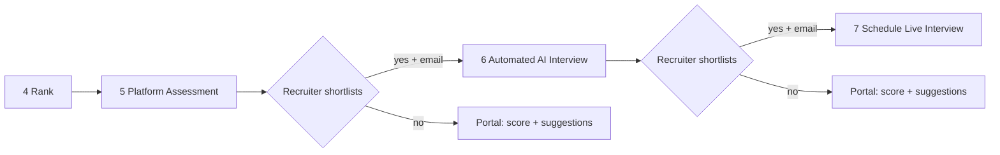

# Interview Workflow & Platform Assessment Overhaul

## Current state vs target

**Today** ([`frontend/src/lib/workflow-status.ts`](frontend/src/lib/workflow-status.ts), [`frontend/src/app/jobs/[id]/page.tsx`](frontend/src/app/jobs/[id]/page.tsx)):
- Steps 1–4: upload → resume → AI eval → rank (keep as-is)
- Step 4b: "Assign Mock Interview" (optional, parallel)
- Step 5: external test URL email
- Step 6: CSV upload of `test_la` / `test_code`
- Step 7: schedule live interviews
- Single `pipeline_stage` on `candidates`; no real shortlist stage; duplicate AI interviews already allowed (multiple `mock_interviews` rows)

**Target flow** (after rank):



External test link + CSV upload remain as an **optional fallback** path (Steps 5b / 6 legacy), not the primary flow.

---

## 1. Terminology: "Mock" → "Automated AI Interview"

**User-facing only** (keep DB table names `mock_interviews` etc. to avoid a risky migration).

| Location | Change |
|----------|--------|
| [`frontend/src/app/jobs/[id]/page.tsx`](frontend/src/app/jobs/[id]/page.tsx) | Step title "Assign Automated AI Interview"; stage labels |
| [`frontend/src/app/candidate/interviews/page.tsx`](frontend/src/app/candidate/interviews/page.tsx) | Tab "AI Interview" instead of "Mock"; subtitle copy |
| [`frontend/src/components/InterviewCard.tsx`](frontend/src/components/InterviewCard.tsx) | Labels, routes unchanged |
| [`backend/app/services/email_service.py`](backend/app/services/email_service.py) | Email subject/body: "Automated AI Interview Invitation" |
| [`frontend/src/lib/api.ts`](frontend/src/lib/api.ts) | `STAGE_LABELS`, display strings |
| [`frontend/src/app/pipeline/page.tsx`](frontend/src/app/pipeline/page.tsx) | Pipeline column labels |

Internal API paths (`/api/mock-interviews/*`) can stay; add aliases later if desired.

---

## 2. Data model (new migration `004_assessments_and_rounds.sql`)

### 2a. Platform assessment (job-level blueprint)

```sql
job_assessments (
  id, job_id, title, duration_minutes,
  config JSONB,          -- { mcq: 5, dsa: 2, sql: 1, passing_score: 60 }
  status,                -- draft | published
  created_at
)

assessment_questions (
  id, assessment_id, type,           -- mcq | dsa | sql
  order_index, prompt, options JSONB,  -- MCQ choices
  correct_answer JSONB,                -- MCQ: index; DSA/SQL: test_cases[]
  starter_code TEXT, metadata JSONB,   -- language, difficulty, tags
  source                 -- ai | manual
)
```

Recruiter builds one assessment per job (reusable across assignments). Questions can be added manually or generated via LLM from job description + optional topic hints.

### 2b. Per-candidate assignment & submission

```sql
assessment_assignments (
  id, assessment_id, candidate_id, job_id,
  attempt_number INT DEFAULT 1,        -- supports re-assign (like duplicate AI cards)
  status,                              -- assigned | in_progress | submitted | graded
  assigned_at, started_at, submitted_at
)

assessment_answers (
  id, assignment_id, question_id,
  response JSONB,                      -- selected_index | code | sql
  score, is_correct, execution_log JSONB, ai_feedback TEXT
)

assessment_results (
  id, assignment_id UNIQUE,
  total_score, section_scores JSONB,   -- { mcq: 80, dsa: 65, sql: 70 }
  outcome,                             -- pending | shortlisted | not_shortlisted
  review JSONB,                        -- strengths, improvements, future_suggestions
  graded_at
)
```

On grade completion, write normalized scores into existing [`test_results`](supabase/migrations/001_initial_schema.sql) (`test_la` ← MCQ avg, `test_code` ← DSA/SQL avg) and trigger [`compute_rankings`](backend/app/services/scoring_engine.py) so ranking still works.

### 2c. Unified round timeline (candidate + recruiter views)

```sql
hiring_rounds (
  id, candidate_id, job_id,
  round_type,              -- platform_test | ai_interview | live_interview | legacy_test
  attempt_number INT,
  reference_id UUID,         -- assessment_assignments.id | mock_interviews.id | scheduled_interviews.id
  status, outcome, total_score,
  review_summary JSONB,
  email_sent BOOLEAN DEFAULT false,
  created_at, completed_at
)
```

Every assign/complete action upserts a `hiring_rounds` row. This replaces relying on a single `pipeline_stage` for round history while **keeping** `pipeline_stage` as a coarse "current step" for backward compatibility.

**Updated stage order** in [`backend/app/api/candidates.py`](backend/app/api/candidates.py):

```
... → ranked → assessment_assigned → assessment_completed
  → ai_interview_assigned → ai_interview_completed → interview_scheduled
  (+ legacy: test_sent, test_completed retained for fallback path)
```

---

## 3. Platform assessment — recruiter experience

**New workflow step 5** in [`frontend/src/app/jobs/[id]/page.tsx`](frontend/src/app/jobs/[id]/page.tsx):

1. **Create / edit assessment** (modal or sub-page `/jobs/[id]/assessment`):
   - Configure counts per type (MCQ, DSA, SQL) with sliders/inputs
   - "Generate with AI" button → `POST /api/assessments/{job_id}/generate` (LLM produces questions + test cases)
   - Manual add/edit/delete/reorder questions
   - Preview each question type
   - Publish assessment

2. **Assign to candidates** (same `CandidatePicker` pattern as today):
   - Select ranked candidates (Top N default)
   - Checkbox: "Send email invite" (default on for **initial** assignment)
   - Creates `assessment_assignments` + `hiring_rounds`; sets `pipeline_stage` → `assessment_assigned`

3. **Review results & shortlist** (sub-panel after submissions):
   - Table: candidate, section scores, total, time taken
   - Actions: **Shortlist** / **Not shortlisted** (bulk or per-row)
   - Shortlisted → optional auto-email for next round; not shortlisted → **no email**, portal updated only

**Legacy fallback** (collapsed section):
- Keep existing "Send external test link" + "Upload CSV results" as Steps 5b / 6 with `round_type: legacy_test`.

**Backend** (new router [`backend/app/api/assessments.py`](backend/app/api/assessments.py)):
- CRUD assessment + questions
- `POST /assign`, `POST /generate-questions`
- `GET /results/{job_id}` for recruiter review
- `POST /shortlist` — set outcome, create round record, conditional email

**Service** [`backend/app/services/assessment_service.py`](backend/app/services/assessment_service.py):
- LLM question generation (structured JSON, same pattern as [`mock_interview_service.generate_questions`](backend/app/services/mock_interview_service.py))
- Grading pipeline (see §4)

---

## 4. Platform assessment — candidate experience & grading

**New routes:**
- [`frontend/src/app/candidate/assessments/page.tsx`](frontend/src/app/candidate/assessments/page.tsx) — list assigned tests
- [`frontend/src/app/candidate/assessments/[assignmentId]/page.tsx`](frontend/src/app/candidate/assessments/[assignmentId]/page.tsx) — take test
- [`frontend/src/app/candidate/assessments/[assignmentId]/results/page.tsx`](frontend/src/app/candidate/assessments/[assignmentId]/results/page.tsx) — score + review

**Test-taking UI:**
- Progress stepper across questions
- **MCQ**: radio/select → instant validation on submit
- **DSA**: code textarea (add `@monaco-editor/react`); language selector (Python default for v1)
- **SQL**: code textarea + schema panel (tables/columns from question metadata)

**Grading strategy** (per your preference: accurate without maintenance-heavy sandboxes):

| Type | v1 approach | Future |
|------|-------------|--------|
| MCQ | Deterministic compare to `correct_answer` | — |
| SQL | **In-browser `sql.js`** — run candidate query, compare result set to expected rows (order-insensitive) | Server sandbox |
| DSA | **LLM + structured rubric** against provided test cases (input/output pairs); show pass/fail per case in review | Piston/Judge0 when self-hosted |

For DSA, store test cases in `correct_answer` as `[{input, expected_output}]`. Backend runs LLM grader prompt with code + cases; returns per-case verdict + score. This is the fastest accurate-enough path without hosting a code runner.

For SQL, `sql.js` runs entirely in the candidate's browser — zero server maintenance, real execution against an in-memory DB seeded from question metadata.

**Post-grade review generation** (LLM, all outcomes):
- `total_score`, section breakdown
- `strengths`, `areas_for_improvement`, **`future_suggestions`** (always shown on portal)
- If `not_shortlisted`: friendly rejection copy in portal; **no email**
- If `shortlisted`: email via new template "You've advanced to the Automated AI Interview"

---

## 5. Reordered steps 6 & 7 — AI interview + live scheduling

**Step 6 — Automated AI Interview** (move after assessment shortlist):
- Reuse existing [`assign_mock_interviews`](backend/app/services/mock_interview_service.py) flow
- Gate UI: only show candidates with `assessment_results.outcome = shortlisted` (or legacy ranked if no platform test)
- On assign: create `hiring_rounds` row (`round_type: ai_interview`, increment `attempt_number`)
- Email checkbox: send invite only when assigning **new** shortlisted candidates
- Re-assign allowed (duplicate cards — already works); each assign = new `mock_interviews` row + new round

**After AI feedback** ([`POST .../feedback`](backend/app/api/mock_interviews.py)):
- Write round completion + score to `hiring_rounds`
- Recruiter shortlists from mock feedback view ([`frontend/src/app/candidates/[id]/page.tsx`](frontend/src/app/candidates/[id]/page.tsx))
- Shortlisted → email for live interview step; not shortlisted → portal-only suggestions (reuse feedback fields)

**Step 7 — Schedule live interview**:
- Gate on AI interview shortlist
- Wire existing [`send-interview-emails`](backend/app/api/interviews.py) into recruiter UI (currently API-only)
- Create `hiring_rounds` row on schedule

---

## 6. Candidate portal — performance after every round

**New: Job application detail view** [`frontend/src/app/candidate/applications/[candidateId]/page.tsx`](frontend/src/app/candidate/applications/[candidateId]/page.tsx):

Timeline for one job showing all `hiring_rounds` ordered by date:

```
Round 1 · Platform Assessment · Attempt 1 · 72/100 · Shortlisted ✓
  → Section scores, review, future suggestions

Round 2 · Automated AI Interview · Attempt 1 · 20/100 · Not shortlisted
  → Link to full feedback page, suggestions (no email was sent)

Round 2 · Automated AI Interview · Attempt 2 · In progress
  → (duplicate assignment case from your screenshot)
```

**API:** extend [`backend/app/api/candidate_portal.py`](backend/app/api/candidate_portal.py):
- `GET /api/candidate/applications/{candidate_id}/rounds` — joins `hiring_rounds` + assessment results + mock feedback
- Enrich `GET /api/candidate/applications` with `current_round`, `latest_outcome`

**Update** [`frontend/src/app/candidate/interviews/page.tsx`](frontend/src/app/candidate/interviews/page.tsx):
- Rename tabs: **Assessments** | **AI Interviews** | **Live**
- Assessments tab lists platform tests; AI tab keeps current mock list

**Applications list** ([`frontend/src/app/candidate/applications/page.tsx`](frontend/src/app/candidate/applications/page.tsx)):
- Link each card to detail page
- Show latest round outcome badge ("Advanced to AI Interview", "Assessment complete — view feedback")

---

## 7. Email notification rules

Centralize in [`backend/app/services/email_service.py`](backend/app/services/email_service.py) + new `notification_service.py`:

| Event | Email? | Portal update |
|-------|--------|---------------|
| Assessment assigned (first time) | Yes (if checkbox) | Assignment appears |
| Assessment graded — shortlisted | Yes ("next round") | Round timeline + review |
| Assessment graded — not shortlisted | **No** | Status + suggestions |
| AI interview assigned (shortlisted) | Yes (if checkbox) | New card in AI tab |
| AI interview done — shortlisted | Yes (schedule invite) | Feedback + timeline |
| AI interview done — not shortlisted | **No** | Feedback + suggestions |
| Live interview scheduled | Yes | Live tab entry |

Rename email types in `email_logs`: `ai_interview_invite` (display), keep old type strings readable in DB.

---

## 8. Scoring engine integration

After platform assessment grade:
- Map section scores → `test_results.test_la` (MCQ average) and `test_results.test_code` (avg of DSA + SQL)
- Call existing ranking recompute
- Recruiter rankings tab continues to work without changes to weight config

Legacy CSV upload path unchanged; both can coexist (platform scores overwrite on latest grade).

---

## 9. Key files to create/modify

**New files:**
- `supabase/migrations/004_assessments_and_rounds.sql`
- `backend/app/api/assessments.py`, `backend/app/schemas/assessment.py`, `backend/app/services/assessment_service.py`, `backend/app/services/grading_service.py`, `backend/app/services/notification_service.py`
- `frontend/src/app/jobs/[id]/assessment/page.tsx` (builder)
- `frontend/src/app/candidate/assessments/**`
- `frontend/src/app/candidate/applications/[candidateId]/page.tsx`
- `frontend/src/components/assessment/**` (QuestionEditor, McqQuestion, CodeQuestion, SqlQuestion, AssessmentTimeline)

**Modify:**
- [`frontend/src/app/jobs/[id]/page.tsx`](frontend/src/app/jobs/[id]/page.tsx) — reorder steps, rename AI step, add assessment step
- [`frontend/src/lib/workflow-status.ts`](frontend/src/lib/workflow-status.ts) — new step IDs, stage counts
- [`frontend/src/lib/api.ts`](frontend/src/lib/api.ts) — types + client methods
- [`backend/app/main.py`](backend/app/main.py) — register assessments router
- [`backend/app/api/candidate_portal.py`](backend/app/api/candidate_portal.py) — rounds endpoint
- [`backend/app/services/mock_interview_service.py`](backend/app/services/mock_interview_service.py) — hiring_rounds hooks, terminology in prompts
- [`backend/app/services/email_service.py`](backend/app/services/email_service.py) — new templates, shortlist-only helpers

**Dependencies to add (frontend):**
- `@monaco-editor/react` — code editor
- `sql.js` — in-browser SQL execution

---

## 10. Implementation phases

### Phase A — Foundation (terminology + data model + rounds API)
- Migration + hiring_rounds CRUD
- Rename all user-facing "mock" strings
- Candidate application detail with round timeline (read-only, wired to existing mock feedback)

### Phase B — Platform assessment (core)
- Assessment builder + AI generation
- Candidate test-taking UI
- MCQ + SQL (sql.js) grading; DSA LLM grading
- Recruiter results + shortlist actions
- Email rules for assessment round

### Phase C — Workflow integration
- Reorder job workflow steps; gate AI interview on assessment shortlist
- Wire live interview emails into UI
- Re-assign / duplicate attempt support for assessments
- Legacy external test path preserved as fallback

### Phase D — Polish
- Recruiter bulk shortlist, export results
- Dashboard widgets on candidate home
- Auth hardening on assessment endpoints (`require_candidate`)

---

## 11. Open design defaults (chosen for you)

- **Shortlisting:** Recruiter manually selects after each round (Top N picker + individual override), consistent with current UX. Optional future: auto-suggest by score threshold.
- **Re-assignment:** Each "Assign" click creates a new attempt (`attempt_number++`); prior attempts remain visible in timeline.
- **Assessment timing:** Optional `duration_minutes` with client-side timer; auto-submit on expiry.
- **Question randomization:** Optional shuffle order per assignment (config flag on assessment).
- **DSA languages v1:** Python only for LLM grading consistency; expand later with sandbox.
