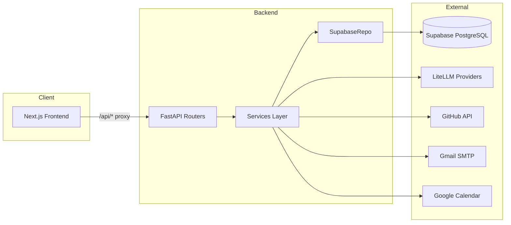
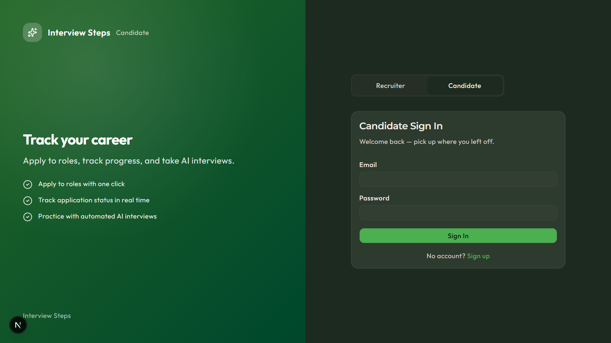
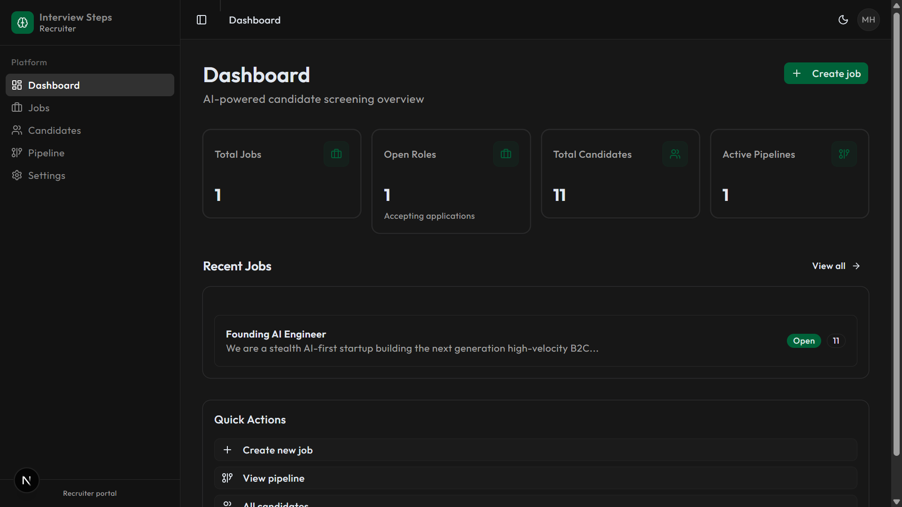
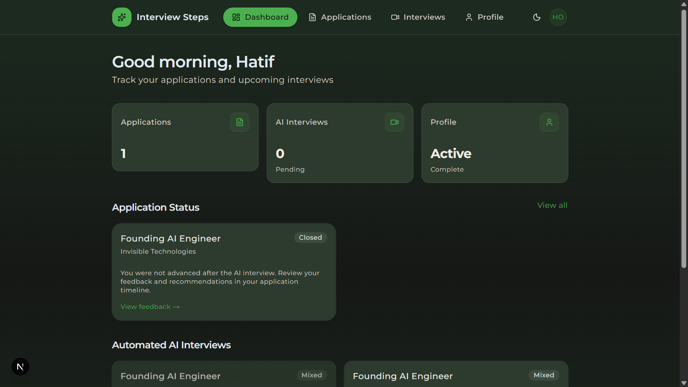
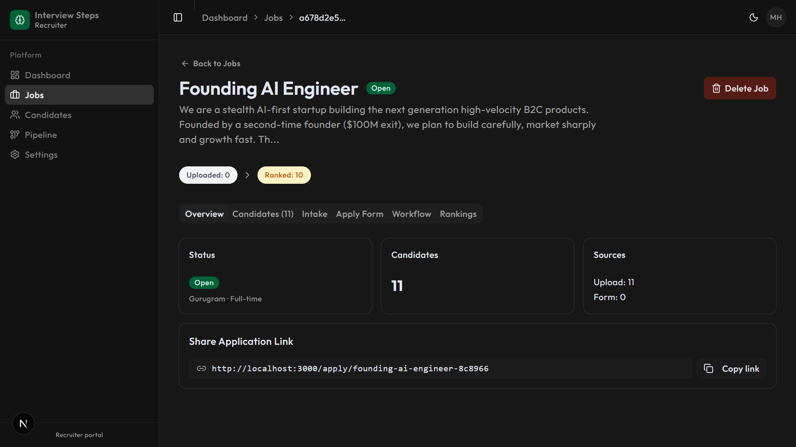
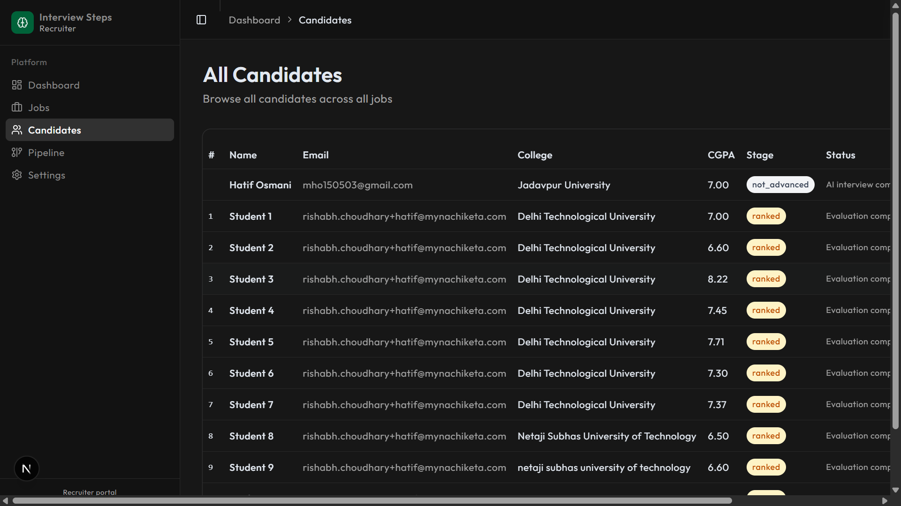
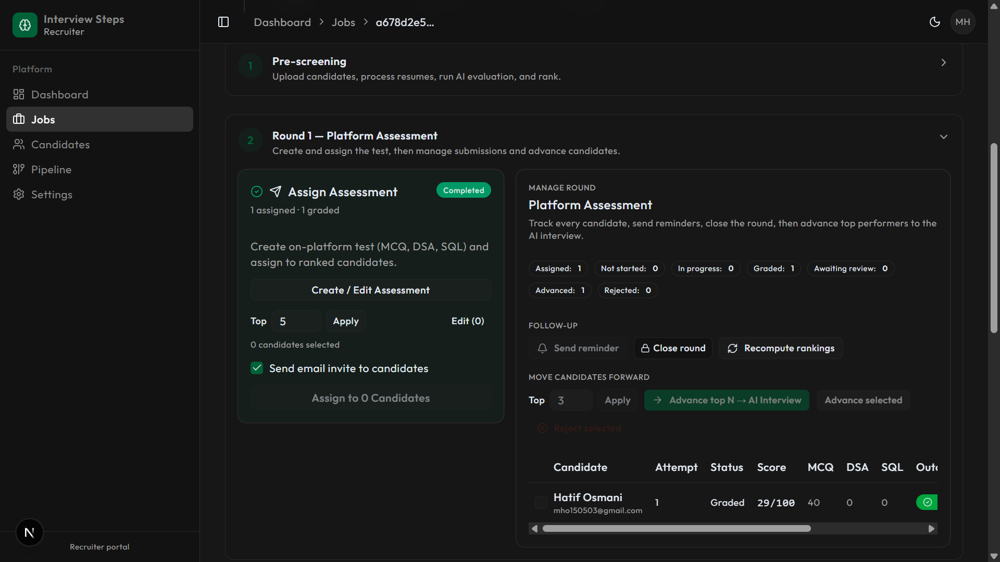
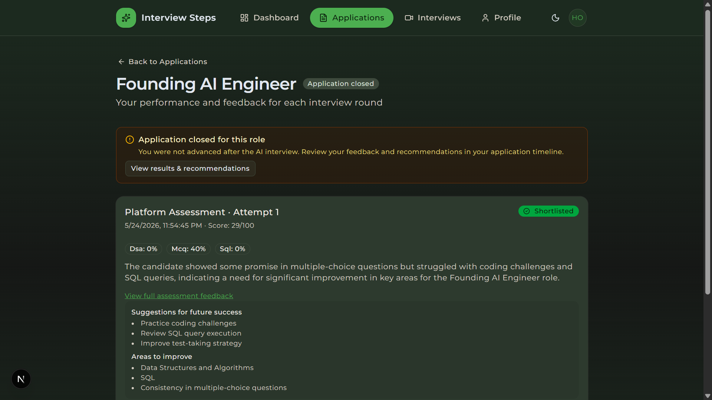
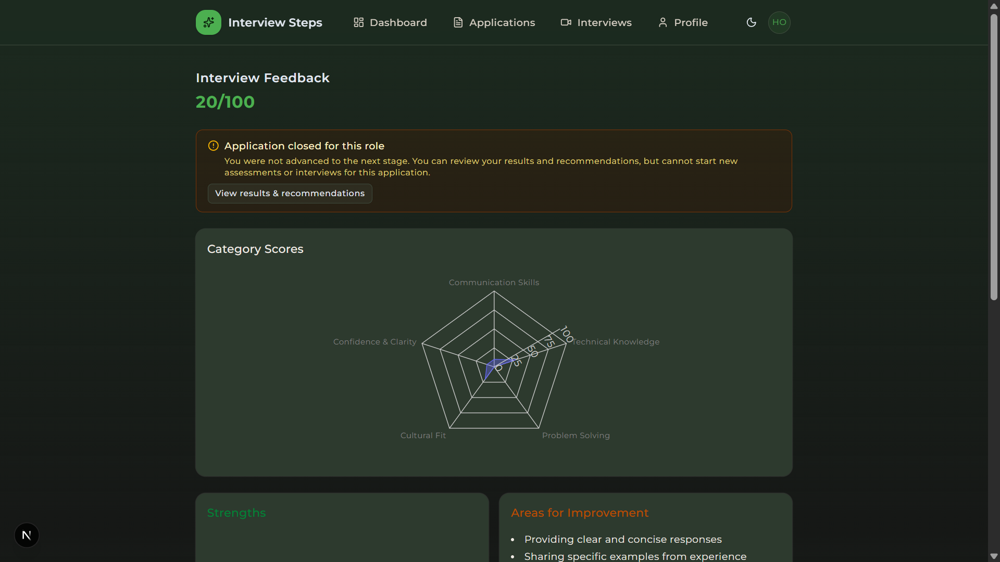

# Interview Steps — AI Candidate Screening & Mock Interview Platform

An AI-powered recruitment pipeline with resume screening, explainable scoring, platform assessments, personalized voice mock interviews, and dual portals for recruiters and candidates. Recruiters manage jobs, evaluate applicants, and advance hiring rounds; candidates apply, take assessments, and receive structured AI feedback — all from a single platform.

---

## Selected Problem Statement

**Hackathon:** [National Level Online Hackathon 2026](https://docs.google.com/document/d/1B0gStupuYRmda48gdrxDHl_YB0v9xh8OlD8HEdEeF7w/edit?usp=sharing) — organized by Steps AI  
**Theme:** _Building Practical AI Solutions for Real-World Challenges_  
**Chosen track:** **Problem Statement 2 — AI Mock Interview Platform**

Develop an intelligent mock interview system that:

- Analyzes uploaded resumes
- Conducts personalized interviews
- Generates role-based questions
- Evaluates candidate responses
- Provides feedback and improvement suggestions

**Domains involved:** Conversational AI · Resume Intelligence · AI Evaluation Systems · Career Technology

### How Interview Steps addresses this

| Requirement | Implementation |
|-------------|----------------|
| Analyze uploaded resumes | PDF parsing (Google Drive links + uploads), LLM extraction, and profile enrichment from candidate data |
| Conduct personalized interviews | Voice mock interviews via browser Web Speech API with multi-turn LLM dialogue (Groq/Gemini/DeepSeek/Qwen fallback) |
| Generate role-based questions | Questions generated from job description, resume, and prior evaluation scores |
| Evaluate candidate responses | Session transcripts scored by LLM with structured rubrics per interview category |
| Provide feedback and improvement suggestions | Structured feedback with category scores, strengths, and actionable improvement areas on the candidate portal |

Beyond the core mock interview scope, the platform also includes a full recruiter screening pipeline (AI evaluation, statistical ranking, platform assessments, and live interview scheduling) to support end-to-end hiring workflows.

---

## Demo Video Link

> **Demo Video:** _Coming soon — add YouTube or Google Drive link here._

---

## Tech Stack Used

| Layer | Technology |
|-------|------------|
| **Frontend** | Next.js 16, React 19, TypeScript, Tailwind CSS v4, shadcn/ui (Radix), Framer Motion, Recharts, TanStack Table |
| **Backend** | FastAPI (Python 3.11+), Pydantic, Uvicorn, BackgroundTasks |
| **Database** | Supabase PostgreSQL (backend access via `supabase-py` service role) |
| **Auth** | Supabase Auth (email/password + optional Google OAuth) |
| **AI / LLM** | LiteLLM with multi-provider fallback (Gemini, Groq, DeepSeek, Qwen) |
| **Embeddings** | Google GenAI SDK (`gemini-embedding-001`) |
| **Voice interviews** | Browser Web Speech API (STT/TTS) — no paid voice APIs |
| **Resume parsing** | pdfplumber, Google Drive PDF download, optional LLM extraction |
| **Data import** | pandas, openpyxl (Excel/CSV) |
| **Scoring** | NumPy, SciPy (Z-scores, CDF percentiles) |
| **GitHub** | GitHub REST API + exponential decay repo scoring |
| **Email** | Gmail SMTP (Jinja2 HTML templates) |
| **Calendar / video** | Google Calendar API + Jitsi Meet links |
| **Storage** | Supabase Storage (`resumes` bucket) |
| **Deploy** | Docker Compose, Render (backend), Vercel (frontend) |

---

## Backend Architecture / System Design

### High-Level Architecture



### Backend Layers

```
backend/app/
├── main.py              # App entry, router registration
├── config.py            # Pydantic settings
├── database.py          # Supabase client + JWT verify
├── supabase_repo.py     # Generic CRUD/query layer (no ORM)
├── api/                 # Route handlers (10 modules)
├── services/            # Business logic
├── schemas/             # Pydantic request/response models
├── core/                # LLM + embeddings
└── deps/auth.py         # require_recruiter / require_candidate
```

| Layer | Responsibility |
|-------|----------------|
| `api/` | HTTP route handlers — jobs, candidates, evaluations, tests, interviews, mock interviews, assessments, auth, public, candidate portal |
| `services/` | Evaluation, scoring, resume parsing, GitHub analysis, assessments, mock interviews, email, calendar |
| `schemas/` | Pydantic DTOs for request validation and response serialization |
| `supabase_repo.py` | PostgREST-style CRUD over Supabase client |
| `deps/auth.py` | JWT verification via Supabase Auth |

### Pipeline State Machine

Candidates progress through a multi-stage pipeline tracked by `pipeline_stage`:

```
UPLOADED → RESUME_PROCESSED → EVALUATING → EVALUATED → RANKED → TEST_SENT → TEST_COMPLETED → SHORTLISTED → INTERVIEW_SCHEDULED
                                                                                                              ↕
                                                                                                            ERROR
```

Each stage supports retry on failure (resume re-download, evaluation re-run). The frontend renders progress as a horizontal bar on job detail pages and a Kanban board on the pipeline page.

For full architecture details, see [docs/architecture.md](docs/architecture.md).

---

## Implementation Approach & Workflow

1. **Recruiter creates a job** with job description, scoring weights, and optional public apply slug
2. **Candidates enter the pipeline** via Excel/CSV upload or public apply link (`/apply/[slug]`)
3. **Background resume processing** downloads Google Drive PDFs, extracts text, and analyzes GitHub profiles
4. **AI evaluation + statistical ranking** produces explainable JSON scores and weighted composite rankings
5. **Platform assessments** (MCQ / DSA / SQL) — recruiter builds or LLM-generates questions, assigns to candidates, grades, and shortlists
6. **AI voice mock interviews** — recruiter assigns personalized interviews; candidate completes them via browser Web Speech API
7. **Live interview scheduling** — Google Calendar events with Jitsi Meet links, email invites via SMTP
8. **Candidate portal** — candidates track applications, take assessments, view mock interview feedback, and manage their profile

---

## Features & Functionalities

### Recruiter Portal (`/`)

- Dashboard with job and candidate statistics
- Job CRUD with JD, scoring weights, and public apply slug
- Multi-sheet Excel/CSV candidate upload with intelligent test-sheet detection
- Resume processing (Google Drive PDFs) and GitHub repository analysis
- AI evaluation with explainable JSON scores and semantic JD matching
- Statistical ranking (Z-score normalization, weighted composite scores)
- Pipeline Kanban view by stage with real-time status updates
- Platform assessment builder — MCQ, DSA, SQL tests with LLM question generation
- Assessment assignment, grading, shortlisting, and round control (advance/reject)
- AI mock interview assignment with optional email invites
- Review mock interview feedback on candidate detail pages
- SMTP test/interview email sending and Jitsi + Calendar scheduling
- Recruiter onboarding and settings

### Candidate Portal (`/candidate`)

- Sign-up and sign-in with Supabase Auth (email/password or Google OAuth)
- Dashboard showing applications, stage progress, and pending interviews
- Application timeline with elimination banners
- Take platform assessments and view results
- Voice AI mock interviews with structured feedback (category scores, strengths, improvement areas)
- Profile and onboarding management
- Public job apply flow via recruiter share link

---

## APIs / Models / Tools Used

### API Route Groups

| Prefix | Purpose |
|--------|---------|
| `/api/jobs` | Job CRUD |
| `/api/candidates` | Upload, pipeline management, resume/GitHub processing |
| `/api/evaluations` | Run AI evaluation, compute rankings |
| `/api/assessments` | Platform tests, assignments, grading, round control |
| `/api/mock-interviews` | AI interview assignment, sessions, feedback |
| `/api/interviews` | Live interview scheduling, email sending |
| `/api/tests` | Legacy test result upload |
| `/api/auth` | Registration, profiles, resume parsing |
| `/api/public` | Public job listing and apply |
| `/api/candidate` | Candidate portal (applications, assessments, interviews) |
| `/api/health` | Health check |

Interactive API docs (Swagger): `http://localhost:8000/docs`

### Database Models

PostgreSQL tables defined in Supabase migrations (`001`–`005`):

| Table | Purpose |
|-------|---------|
| `jobs` | Job postings, weights, apply slug, round status |
| `users` | App profiles linked to Supabase Auth |
| `candidates` | Per-job applicant records, pipeline stage, resume data |
| `evaluations` | AI evaluation scores + JSON explanations |
| `scores` | Composite ranking scores and Z-scores |
| `test_results` | Legacy external test scores |
| `scheduled_interviews` | Live interview schedule + Jitsi links |
| `email_logs` | Outbound email audit trail |
| `mock_interviews` | AI interview definitions |
| `mock_sessions` | Active/completed interview sessions + transcript |
| `mock_feedback` | Post-interview AI feedback scores |
| `recruiter_profiles` | Recruiter onboarding / company info |
| `candidate_profiles` | Candidate onboarding profile |
| `job_assessments` | Platform MCQ/DSA/SQL assessments |
| `assessment_questions` | Questions per assessment |
| `assessment_assignments` | Candidate ↔ assessment attempts |
| `assessment_answers` | Per-question responses and grades |
| `assessment_results` | Aggregated assessment outcomes |
| `hiring_rounds` | Unified hiring timeline |

Storage bucket: `resumes` (public read) — see [supabase/migrations/003_resume_storage_bucket.sql](supabase/migrations/003_resume_storage_bucket.sql)

Pydantic schemas live in [backend/app/schemas/](backend/app/schemas/).

### External Tools & Integrations

| Tool | Role |
|------|------|
| **Supabase** | PostgreSQL DB, Auth, Storage |
| **LiteLLM** | Unified LLM gateway with multi-provider fallback |
| **Google Gemini** | Primary LLM + embeddings |
| **Groq** | Fast open models for mock interview dialogue |
| **DeepSeek / Qwen** | Feedback and generation fallback |
| **GitHub REST API** | Repository analysis for candidate scoring |
| **Gmail SMTP** | Test invites, interview invites, mock interview invites |
| **Google Calendar API** | Schedule calendar events for live interviews |
| **Jitsi Meet** | Free video call links (generated, no API key required) |
| **Google Drive** | Resume PDF download from shared links |
| **Web Speech API** | Browser STT/TTS for voice mock interviews (frontend) |
| **pdfplumber / pandas / openpyxl** | Resume PDF and Excel/CSV parsing |
| **NumPy / SciPy** | Z-score normalization and CDF percentiles |

---

## Setup Instructions to Run Locally

### Prerequisites

- Python 3.11+
- Node.js 20+
- Supabase project ([supabase.com](https://supabase.com) — free tier)
- API keys: **Gemini** (required), **Groq** (recommended for mock interviews)

### Supabase Setup

1. Create a project at [supabase.com](https://supabase.com)
2. Open **SQL Editor** and run all migrations in order:
   - [`supabase/migrations/001_initial_schema.sql`](supabase/migrations/001_initial_schema.sql)
   - [`supabase/migrations/002_portal_profiles_and_apply.sql`](supabase/migrations/002_portal_profiles_and_apply.sql)
   - [`supabase/migrations/003_resume_storage_bucket.sql`](supabase/migrations/003_resume_storage_bucket.sql)
   - [`supabase/migrations/004_assessments_and_rounds.sql`](supabase/migrations/004_assessments_and_rounds.sql)
   - [`supabase/migrations/005_round_control.sql`](supabase/migrations/005_round_control.sql)
3. Under **Authentication → Providers**, enable **Google** (optional)
4. Set **URL Configuration**:
   - Site URL: `http://localhost:3000`
   - Redirect URLs: `http://localhost:3000/auth/callback`
5. Copy credentials from **Project Settings → API**

Full steps: [supabase/README.md](supabase/README.md)

### Backend

```bash
cd backend
python -m venv venv
venv\Scripts\activate          # Windows
# source venv/bin/activate     # macOS / Linux
pip install -r requirements.txt
cp .env.example .env           # fill in Supabase + API keys
uvicorn app.main:app --reload --port 8000
```

### Frontend

```bash
cd frontend
npm install
cp .env.example .env.local     # fill in Supabase keys
npm run dev
```

The frontend proxies `/api/*` requests to the backend via [frontend/next.config.ts](frontend/next.config.ts).

### Docker (Alternative)

```bash
docker-compose up
```

Runs backend on `:8000` and frontend on `:3000`.

### Local URLs

| URL | Description |
|-----|-------------|
| `http://localhost:3000` | Recruiter dashboard |
| `http://localhost:3000/sign-in` | Recruiter sign-in |
| `http://localhost:3000/candidate` | Candidate portal |
| `http://localhost:8000/api` | Backend API |
| `http://localhost:8000/docs` | Swagger API docs |

---

## Environment Variables Required

### Backend

Copy [`backend/.env.example`](backend/.env.example) to `backend/.env`.

| Variable | Required | Purpose |
|----------|----------|---------|
| `SUPABASE_URL` | Yes | Supabase project URL |
| `SUPABASE_SERVICE_ROLE_KEY` | Yes | Backend DB and storage access (bypasses RLS) |
| `LITELLM_MODEL` | Yes | Primary LLM (e.g. `gemini/gemini-2.0-flash`) |
| `GEMINI_API_KEY` | Yes | Google Gemini API key for LLM + embeddings |
| `GROQ_API_KEY` | Recommended | Groq API for mock interview fallback chain |
| `DEEPSEEK_API_KEY` | Optional | DeepSeek API for LLM fallback |
| `DASHSCOPE_API_KEY` | Optional | Alibaba DashScope / Qwen models |
| `MOCK_TURN_MODELS` | Optional | Comma-separated LiteLLM models for interview dialogue |
| `MOCK_GENERATE_MODELS` | Optional | Comma-separated models for question generation |
| `MOCK_FEEDBACK_MODELS` | Optional | Comma-separated models for feedback scoring |
| `EMBEDDING_MODEL` | Optional | Google GenAI embedding model (default: `gemini-embedding-001`) |
| `GITHUB_TOKEN` | Optional | GitHub PAT for higher API rate limits |
| `SMTP_HOST` | Optional | SMTP server (default: `smtp.gmail.com`) |
| `SMTP_PORT` | Optional | SMTP port (default: `587`) |
| `SMTP_USER` | Optional | SMTP login username |
| `SMTP_PASSWORD` | Optional | SMTP password / Gmail app password |
| `FROM_EMAIL` | Optional | Sender address for outbound emails |
| `GOOGLE_CREDENTIALS_JSON` | Optional | Single-line JSON service account for Google Calendar |
| `GOOGLE_CALENDAR_ID` | Optional | Target calendar ID (default: `primary`) |
| `FRONTEND_URL` | Optional | Base URL for candidate portal links in emails |
| `BACKEND_URL` | Optional | Backend base URL |
| `TEST_LINK_BASE_URL` | Optional | Base URL for external test platform links |

### Frontend

Copy [`frontend/.env.example`](frontend/.env.example) to `frontend/.env.local`.

| Variable | Required | Purpose |
|----------|----------|---------|
| `NEXT_PUBLIC_SUPABASE_URL` | Yes | Supabase project URL for client auth |
| `NEXT_PUBLIC_SUPABASE_ANON_KEY` | Yes | Supabase anon key for client-side auth |
| `NEXT_PUBLIC_API_URL` | No | FastAPI base URL (defaults to `/api` proxy) |
| `API_PROXY_TARGET` | No | Dev rewrite target for `/api/*` (default: `http://127.0.0.1:8000`) |

---

## Installation Steps

1. **Clone the repository**
   ```bash
   git clone <repo-url>
   cd interview-steps
   ```

2. **Create a Supabase project** and run all five SQL migrations (see [Setup Instructions](#setup-instructions-to-run-locally))

3. **Configure Auth providers** — enable Google OAuth (optional) and set redirect URLs

4. **Set up the backend**
   ```bash
   cd backend
   python -m venv venv
   venv\Scripts\activate
   pip install -r requirements.txt
   cp .env.example .env
   # Edit .env with your Supabase URL, service role key, and API keys
   uvicorn app.main:app --reload --port 8000
   ```

5. **Set up the frontend** (in a new terminal)
   ```bash
   cd frontend
   npm install
   cp .env.example .env.local
   # Edit .env.local with your Supabase URL and anon key
   npm run dev
   ```

6. **Open the app** at `http://localhost:3000` (recruiter) or `http://localhost:3000/candidate` (candidate)

7. **(Optional) Docker Compose** — run `docker-compose up` from the repo root instead of steps 4–5

---

## Screenshots

### Landing & Dashboards

| Landing | Recruiter Dashboard | Candidate Dashboard |
|---------|---------------------|---------------------|
|  |  |  |

### Recruiter Views

| Jobs | Candidates | Pipeline |
|------|------------|----------|
|  |  |  |

### Candidate Views

| Applications | Feedback |
|--------------|----------|
|  |  |

---

## Deployment

- **Backend**: Render (Docker) — set `SUPABASE_URL` and `SUPABASE_SERVICE_ROLE_KEY`
- **Frontend**: Vercel — set `NEXT_PUBLIC_SUPABASE_*` and `NEXT_PUBLIC_API_URL`
- **Database**: apply all migrations from `supabase/migrations/`

---

## Reference

- Full architecture: [docs/architecture.md](docs/architecture.md)
- Supabase setup: [supabase/README.md](supabase/README.md)
- Official hackathon problem statement: [National Level Online Hackathon 2026 (Google Doc)](https://docs.google.com/document/d/1B0gStupuYRmda48gdrxDHl_YB0v9xh8OlD8HEdEeF7w/edit?usp=sharing)
- Screening engine analysis (extended scope): [prd/Building a Candidate Screening Engine.md](prd/Building%20a%20Candidate%20Screening%20Engine.md)
